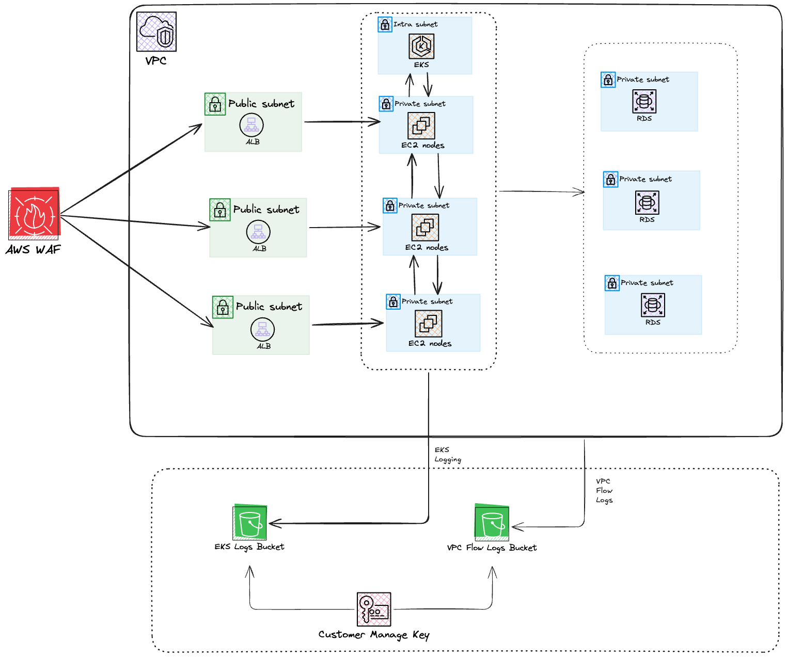
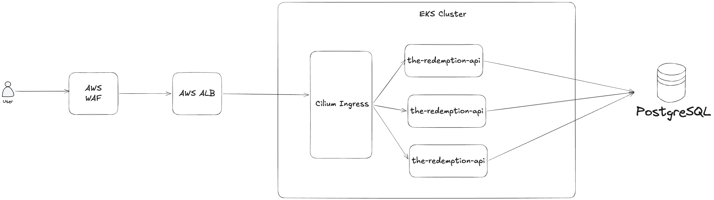

# The Redemption Assessment

his is the reviewer guide for The Redemption assessment. It includes links to the Terraform and Kubernetes repositories, ADRs (Architectural Decision Records), and Day-2 Operations Delegation Guides.

# Introduction 

The Redemption assessment presents a production-grade AWS EKS platform design for a business-critical microservice responsible for hotel point redemption and deduction workflows.

The goal of this submission is to demonstrate how the service can remain available, scalable, secure, and observable under real production pressure, including sudden traffic spikes, infrastructure failures, and bad deployments.

This reviewer guide acts as the central entry point for the complete assessment package. It links to the Terraform infrastructure repository, Kubernetes and GitOps repositories, Helm chart repositories, architecture diagram, Architectural Decision Records, and Day-2 operations delegation plan.

The implementation follows a production-style separation of responsibilities:

- Terraform provisions the AWS infrastructure foundation.
- Helm packages reusable Kubernetes workloads and capacity definitions.
- Argo CD manages production Kubernetes desired state through GitOps.
- Karpenter provides EC2 workload capacity for flash-sale scaling.
- Prometheus, Loki, dashboards, alerts, and Kyverno provide focused observability and baseline policy controls.
- ADRs document the key architectural decisions, trade-offs, and alternatives considered.

Because no real application artifact or database schema was provided, this submission includes a lightweight mock `redemption-service` to validate the platform behavior end to end. The mock service is intentionally minimal and is used to demonstrate deployment, health checks, autoscaling, logging, metrics, routing, and rollback behavior. It is not intended to represent Accor’s actual business logic.

The design prioritizes production judgment over unnecessary component count. The initial implementation focuses on the critical platform foundation, while additional capabilities such as enterprise SSO, private Argo CD exposure, long-term observability retention, progressive delivery, and disaster recovery exercises are documented as Day-2 operational improvements.

# Review Order

1. Review this [README introduction](#introduction).
2. Open the [AWS and data-flow diagrams](#diagrams) under [`assets/`](./assets/).
3. Review the [Terraform repository](https://github.com/khantnaingset-kns/the-redemption-terraform).
4. Review the [Platform Bootstrap and Availability Strategy](#platform-bootstrap-and-availability-strategy).
5. Review the [Helm chart repository](https://github.com/khantnaingset-kns/the-redemption-helm-charts).
6. Review the [GitOps production repository](https://github.com/khantnaingset-kns/the-redemption-gitops-prod).
7. Review the ADR sections in this document: [ADR-001](#adr-001-the-multiple-repos-structure), [ADR-002](#adr-002-use-self-managed-argo-cd), and [ADR-003](#adr-003-the-eks-and-karpenter).
8. Review [Day-2 Operations and Team Delegation](#day-2-operations-and-team-delegation).


# Diagrams

## AWS Diagram



## DataFlow Diagram



# Platform Bootstrap and Availability Strategy

The platform is designed so that critical bootstrap and control-plane-adjacent components are not dependent on the worker nodes they help provision or manage.

Karpenter, Argo CD, CoreDNS, and other required bootstrap components are scheduled onto EKS Fargate where appropriate. This ensures that the GitOps control plane and cluster autoscaling control plane can start even before Karpenter-managed EC2 NodePools are available.

This avoids a bootstrap deadlock where:

```text
No EC2 nodes
  -> Argo CD cannot start
  -> Argo CD cannot deploy NodePools
  -> Karpenter cannot provision nodes
  -> application workloads remain pending
```

By running Argo CD and Karpenter on Fargate, the platform keeps the deployment and scaling control planes independent from the EC2 worker nodes they manage. Application workloads and heavier platform workloads are then scheduled onto Karpenter-managed EC2 NodePools after capacity is available.

For application high availability, the API workload uses topology spread constraints with maxSkew to distribute replicas across failure domains. This reduces the risk of multiple replicas being concentrated in a single Availability Zone or node. The default PodDisruptionBudget keeps at least two API replicas available during voluntary disruptions such as node drain, consolidation, or rolling updates. For details HA config you can review in the code and ADR-003 section.

The GitOps repository also includes Prometheus alert rules under:

/infrastructure/prometheus-operator/alerts

These alerts cover the main production failure scenarios:

- Availability Zone degradation or uneven pod distribution
- Bad deployment symptoms such as high error rate, crash loops, and failed rollouts
- Baseline service metrics such as request rate, latency, error rate, saturation, pod availability, and HPA behavior
- Karpenter provisioning issues and pending pods
- Infrastructure health signals required for Day-2 operations

This approach keeps the initial platform operationally safe while remaining practical for a small team. The system can bootstrap itself, scale workloads through Karpenter, maintain API availability across zones, and surface failure signals through GitOps-managed monitoring rules.

# Security & Networking

The platform applies defense in depth across the AWS network layer, Kubernetes networking layer, and encryption layer.

At the AWS networking layer, the service is exposed through AWS WAF and an internet-facing Application Load Balancer. Public access is limited to the ALB/WAF entry point, while EKS workloads run in private subnets and the database layer runs in isolated subnets with no direct internet route.

Cilium is used as the Kubernetes networking and policy layer. It provides Kubernetes NetworkPolicy enforcement and improves runtime network visibility through Hubble. This allows the platform to restrict pod-to-pod communication and reduce lateral movement inside the cluster. Cilium is configured to avoid scheduling on Fargate workloads, while EC2-based workloads run on Karpenter-managed NodePools.

Encryption is applied across multiple layers:

- EKS secrets encryption is enabled.
- KMS is used for encrypted log storage where applicable.
- VPC Flow Logs are written to an encrypted S3 bucket using SSE-KMS.
- S3 buckets block public access and use lifecycle policies for retention management.
- RDS is designed to enforce SSL connections and use secure password encryption.
- Master database credentials are managed through AWS Secrets Manager.

For application traffic, TLS is terminated at the ALB edge layer. After ALB termination, internal service communication can still use SSL/TLS between the ingress layer and backend services where required. This allows the platform to keep external certificate management centralized at the ALB while still supporting encrypted internal traffic for sensitive service paths.

The networking model is intentionally segmented:

```text
Internet
  -> AWS WAF
  -> Public ALB
  -> Private EKS workloads
  -> Isolated RDS PostgreSQL
```

This keeps the public attack surface small, separates workload and database tiers, and gives the platform multiple security control points before traffic reaches the application.

# ADR-001 The Multiple Repos Structure

## Context

The Redemption platform has several separate concerns:

- AWS infrastructure provisioning
- EKS bootstrap
- reusable Kubernetes manifests
- production GitOps desired state
- architecture documentation
- Day-2 operations planning

These concerns have different lifecycles, owners, review processes, and blast radius. A single repository would be simpler to browse, but it would mix infrastructure, Helm packaging, GitOps state, and operational documentation into one change surface.

## Decision

Use a production-style multi-repository structure:

| Repository | Responsibility |
|---|---|
| Reviewer / Gateway Repo | Central reviewer entry point, links, architecture diagram, ADRs, and Day-2 docs |
| Terraform Repo | AWS infrastructure and EKS bootstrap foundation [Terraform Repo](https://github.com/khantnaingset-kns/the-redemption-terraform) |
| Helm Chart Repos | Reusable Kubernetes manifests and capacity definitions [Helm Charts Repo](https://github.com/khantnaingset-kns/the-redemption-helm-charts) |
| GitOps Repo | Production cluster desired state managed by Argo CD [GitOps Repo](https://github.com/khantnaingset-kns/the-redemption-gitops-prod) |


## Rationale

This structure keeps responsibilities clear:

- Terraform provisions AWS infrastructure.
- Helm packages reusable Kubernetes resources.
- GitOps represents the production cluster state.
- Operations docs capture runbooks, delegation, and future improvements.

This mirrors a real production platform more closely than a single monorepo.

## Deployment

- Run `terraform apply` to provision the AWS infrastructure and install Argo CD.
- After Terraform completes, apply `bootstrap-gitops.yaml` from the GitOps repository to bootstrap the cluster desired state. [GitOps Repo](https://github.com/khantnaingset-kns/the-redemption-gitops-prod) |

# ADR-002: Use Self-Managed Argo CD

## Context

The platform needs a GitOps controller to manage production Kubernetes desired state.

Argo CD will be responsible for deploying and reconciling:

- infrastructure applications
- Karpenter capacity resources
- observability components
- Kyverno policies
- business application workloads

Amazon EKS provides an Argo CD capability, but it is tied to AWS Identity Center for authentication. In a real enterprise environment, the organization may already use another identity provider such as Microsoft Entra ID, Okta, Google Workspace, Auth0, or another OIDC/SAML provider.

The assessment also requires a simple and reliable bootstrap path.

## Decision

Use self-managed Argo CD installed through Helm.

Argo CD will be deployed into the `argocd` namespace and managed as part of the platform bootstrap process.

For the initial implementation:

- Argo CD is installed by Terraform using Helm.
- Argo CD runs on EKS Fargate during bootstrap.
- Argo CD UI ingress is disabled.
- Access can be performed through `kubectl port-forward`.
- Enterprise SSO integration is treated as a Day-2 enhancement.

## Rationale

Self-managed Argo CD is preferred because it is easier to bootstrap, easier to operate under the assessment scope, and more flexible for enterprise SSO integration.

Key reasons:

- standard Argo CD behavior
- simpler local bootstrap
- no hard dependency on AWS Identity Center
- supports many SSO providers through OIDC/SAML/Dex
- works cleanly with AppProjects and app-of-apps
- easier to reason about for GitOps repository structure
- avoids capability-specific cluster registration behavior

This keeps the platform focused on EKS, Karpenter, GitOps, security, observability, and Day-2 operations instead of expanding the scope into organization-level identity management.

# ADR-003 The EKS and Karpenter

## Context

The Redemption service must handle normal baseline traffic and sudden flash-sale traffic spikes while remaining available during infrastructure failures such as an Availability Zone outage.

The platform team is small, with one senior engineer and two junior engineers, so the compute model must be powerful but still operable without excessive day-to-day toil.

## Decision

Use Amazon EKS with Karpenter-managed EC2 NodePools for workload capacity.

Karpenter will provision right-sized EC2 nodes based on pending pods, workload requirements, taints, labels, and NodePool constraints.Karpenter also runs on Fargate, similar to Argo CD, so the autoscaling control plane does not depend on the EC2 nodes it manages.

The platform uses multiple NodePools:

| NodePool | Purpose |
|---|---|
| `general-purpose` | Infrastructure and general workloads |
| `api` | Compute-optimized API workloads for the Redemption service |

Both NodePools use on-demand capacity for production stability.

## Rationale

Karpenter is preferred because it provides more control than a static managed node group strategy.

Key reasons:

- more flexible instance selection
- workload-specific NodePools
- better right-sizing
- faster response to unschedulable pods
- better cost control through consolidation
- support for separate workload tiers
- enough operational simplicity for a three-person platform team

The design avoids one large generic node group. Instead, workloads are placed on the most appropriate NodePool through labels, taints, tolerations, and scheduling constraints.

## NodePool Strategy

### General Purpose NodePool

Used for common platform workloads that do not require compute-optimized instances.

Example instance families:

```yaml
- m7i.large
- m7i.xlarge
- m7a.large
- m7a.xlarge
```

### API NodePool

Used for latency-sensitive API workloads.

Example instance families:

```yaml
- c7i.large
- c7i.xlarge
- c7a.large
- c7a.xlarge
```

This separates API capacity from general infrastructure workloads and reduces noisy-neighbor risk.

### Multi-AZ Availability

Karpenter discovers subnets using the cluster discovery tag:

- karpenter.sh/discovery: prod-the-redemption
- The selected subnets span multiple Availability Zones.\
- The API workload should also use Kubernetes scheduling controls such as:

    - topology spread constraints
    - PodDisruptionBudget
    - multiple replicas
    - readiness probes
    - rolling updates

This ensures API pods can spread across zones and continue serving traffic if one Availability Zone has issues.

### Scaling Flow

```text
Traffic spike
  -> HPA increases desired replicas
  -> pods become pending
  -> Karpenter observes unschedulable pods
  -> Karpenter provisions matching EC2 nodes
  -> new nodes join EKS
  -> pods become ready
  -> ALB routes traffic to healthy pods
```

### Cost Controls

Karpenter consolidation is enabled:

```yaml
disruption:
  consolidationPolicy: WhenEmptyOrUnderutilized
  consolidateAfter: 5m
```

This allows unused or underutilized nodes to be removed after demand drops.NodePool limits are also used to prevent uncontrolled scale-out:

```yaml
limits:
  cpu: "200"
  memory: 500Gi
```

## Security and Hardening

The EC2NodeClass uses:

```yaml
amiFamily: AL2023
metadataOptions:
  httpEndpoint: enabled
  httpTokens: required
  httpPutResponseHopLimit: 2
```

This enforces IMDSv2 and reduces metadata exposure risk.

Nodes are launched using the Karpenter node IAM role and are tagged for ownership and environment tracking.

#### Consequences

Positive

- Better workload right-sizing
- Stronger API workload isolation
- Faster scale-out during traffic spikes
- Reduced cost through consolidation
- Multi-AZ capacity placement
- Flexible future expansion for more workload tiers

Negative

- Requires careful NodePool and EC2NodeClass management
- Requires good observability around pending pods and provisioning failures
- Workloads must define matching tolerations and scheduling rules
- Incorrect taints can block workloads from scheduling


#### Implementation Note

Persistent workload isolation should use taints.

startupTaints should only be used for temporary bootstrap conditions that another controller removes later, such as Cilium initialization taints. If no controller removes the startup taint, it may prevent workloads from scheduling correctly.

For workload-tier isolation, the safer default is:

```yaml
taints:
  - key: workload-tier
    value: api
    effect: NoSchedule
```

Then the workload Helm chart should define matching tolerations.

# Day-2 Operations and Team Delegation

## Day-2 Operations Strategy

The initial implementation focuses on the critical production foundation: AWS infrastructure, EKS bootstrap, Karpenter scaling, GitOps deployment, observability basics, and application availability controls.

Day-2 operations focus on reducing toil, improving production safety, and making the platform easier for a small team to operate.

Key Day-2 priorities:

- alert tuning based on real production traffic
- long-term log and metrics retention
- expanded Grafana dashboards
- enterprise SSO for Argo CD
- private Argo CD ingress or private ALB access
- synthetic monitoring for the redemption flow
- production load-test automation for flash-sale scenarios
- disaster recovery and AZ failure game days
- Karpenter cost optimization
- image scanning, signing, and verification
- runbook development and post mortem after real incidents
- Log collection and aggregation setup.

The goal is to keep the initial platform focused and safe while creating a clear path for operational maturity.

## Operational Toil Reduction

The platform reduces Day-2 operational toil through:

- Terraform for repeatable AWS infrastructure provisioning
- Argo CD GitOps for Kubernetes desired-state management
- Helm charts for reusable Kubernetes packaging
- Karpenter for automated EC2 capacity provisioning
- Prometheus alerts for early failure detection
- Loki logs for troubleshooting
- Kyverno policies for baseline admission control
- Git-based rollback for bad deployments
- topology spread constraints and PodDisruptionBudgets for safer workload availability

This avoids manual cluster changes and keeps production operations reviewable through Git.

## Team Delegation Plan

The implementation is designed for a team of three engineers:

| Role | Initial Responsibilities | Day-2 Responsibilities |
|---|---|---|
| Senior Engineer | Own architecture, Terraform foundation, EKS/Karpenter design, security model, final integration, and review | Production readiness review, cost optimization, DR planning, incident review, architecture improvements |
| Junior Engineer 1 | Own Helm charts, application manifests, HPA, PDB, service account, ingress/routing, and environment values | Progressive delivery, deployment automation, application rollout improvements, workload hardening |
| Junior Engineer 2 | Own observability, Prometheus alerts, Loki logging, Grafana dashboards, Kyverno policies, and runbook drafts | Alert tuning, dashboard expansion, synthetic checks, long-term retention, operational documentation |

The senior engineer owns final approval and integration across repositories.  
Junior engineers own scoped implementation areas with clear review boundaries.

## Day-2 Backlog


| Priority | Item | Owner |
|---|---|---|
| P0 | Validate production alerts for 5xx rate, latency, pod availability, HPA saturation, and Karpenter provisioning failures | Junior Engineer 2 |
| P0 | Create runbooks for AZ outage, bad deployment, Karpenter failure, database degradation, and observability degradation | Senior Engineer + Junior Engineer 2 |
| P0 | Implement a reliable log collection and aggregation flow to Loki | Junior Engineer 1 |
| P0 | Expose internal operational tools such as Argo CD and Grafana through a private access path using Private ALB, VPN, TLS, and access controls | Senior Engineer |
| P0 | Install and Setup Trivy for Containers Security | Junior Engineer 2 |
| P0 | Setup Cert Manager for internal SSL | Junior Engineer 1 |
| P1 | Integrate Argo CD with enterprise SSO and group-based RBAC | Senior Engineer |
| P1 | Setup a dashboard for Log Drop and Throghput to Loki  | Junior Engineer 2 |
| P1 | Integrate Grafana with enterprise SSO and role-based access control | Senior Engineer |
| P1 | Create developer-friendly log exploration dashboards for application troubleshooting | Junior Engineer 1 |
| P1 | Deploy a controlled database access interface such as CloudBeaver for developer and support troubleshooting | Senior Engineer |
| P1 | Add long-term metrics and log retention | Junior Engineer 2 |
| P1 | Add production flash-sale load-test automation | Junior Engineer 1 |
| P1 | Tune Karpenter NodePools for cost, availability, and performance | Senior Engineer |
| P2 | Promote selected Kyverno policies from Audit mode to Enforce mode after exception review | Junior Engineer 2 |
| P2 | Add image signing and vulnerability scanning gates | Junior Engineer 1 |
| P2 | Run disaster recovery and AZ failure game days | Senior Engineer |
| P2 | Add progressive delivery strategy such as canary or blue/green deployments | Junior Engineer 1 |
| P2 | Expand application performance dashboards with service-level metrics, latency breakdowns, error patterns, and dependency health | Junior Engineer 2 |

## Failure Scenario Ownership

| Scenario | Detection | First Response | Owner |
|---|---|---|---|
| AZ outage | Pod distribution alerts, ALB target health, node health | Verify pod spread, confirm traffic routing, monitor Karpenter replacement capacity | Senior Engineer |
| Bad deployment | High 5xx, rollout failure, crash loops, readiness failures | Revert Git commit and let Argo CD restore last known-good state | Junior Engineer 1 |
| 10x traffic spike | HPA saturation, pending pods, Karpenter provisioning alerts | Confirm HPA scale-out, Karpenter node provisioning, ALB target health | Senior Engineer |
| Observability degradation | Prometheus/Loki ingestion alerts | Check collectors, storage, and scraping targets | Junior Engineer 2 |
| Database degradation | DB latency, connection saturation, application error rate | Check connection pool, DB metrics, slow queries, and failover status | Senior Engineer |

## Day-2 Principle

Not every production feature belongs in the initial implementation.

The initial submission provides the foundation required to run and validate the platform. Day-2 operations then improve maturity through better access control, deeper observability, stronger policy enforcement, cost tuning, and operational drills.

This keeps the platform practical for a small team while still giving a clear roadmap toward enterprise production readiness.
